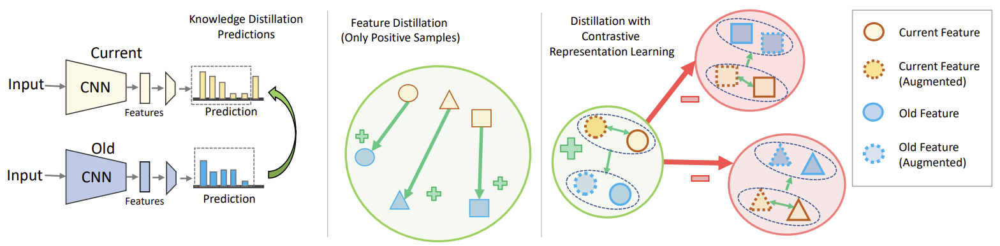

# CL3: Generalization of Contrastive Loss for Lifelong Learning

<p align="center" style="text-align: center;">
    
    Code for <a style='ext-align: center;' href="https://www.mdpi.com/2313-433X/9/12/259">CL3: Generalization of Contrastive Loss for Lifelong Learning</a>.
</p>


# Abstract
Lifelong learning portrays learning gradually in nonstationary environments and emulates
the process of human learning, which is efficient, robust, and able to learn new concepts incrementally
from sequential experience. To equip neural networks with such a capability, one needs to overcome
the problem of catastrophic forgetting, the phenomenon of forgetting past knowledge while learning
new concepts. In this work, we propose a novel knowledge distillation algorithm that makes use of
contrastive learning to help a neural network to preserve its past knowledge while learning from a
series of tasks. Our proposed generalized form of contrastive distillation strategy tackles catastrophic
forgetting of old knowledge, and minimizes semantic drift by maintaining a similar embedding space,
as well as ensures compactness in feature distribution to accommodate novel tasks in a current model.
Our comprehensive study shows that our method achieves improved performances in the challenging
class-incremental, task-incremental, and domain-incremental learning for supervised scenarios.


# Repository Contributions

This repository contains the implementation of the paper 'CL3: Generalization of Contrastive Loss for Lifelong Learning'. 

If you find this code useful, please reference in our paper:

```
@article{roy2023cl3,
  title={CL3: Generalization of Contrastive Loss for Lifelong Learning},
  author={Roy, Kaushik and Simon, Christian and Moghadam, Peyman and Harandi, Mehrtash},
  journal={Journal of Imaging},
  volume={9},
  number={12},
  pages={259},
  year={2023},
  publisher={MDPI}
}
```

# Getting Started

Unlike other methods for lifelong learning, CL3 demands a preliminary training phase for discrimiative feature learning and adaptation of feature space to adapt novel knowledge, driven by its adoption of a contrastive representation learning-based distillation strategy. Therefore, the results presented in our paper can be obtained via linear evaluation using representations extracted from pre-trained  backbone. Please follow the instructions outlined below.

## Representation Learning
```
python main.py --batch_size 512 --model resnet18 --dataset cifar10 --mem_size 200 --epochs 100 --start_epoch 500 --learning_rate 0.5 --temp 0.5  --cosine --syncBN
```

## Linear Evaluation
```
python main_linear_buffer.py --learning_rate 1 --target_task 4 --ckpt ./save_random_200/cifar10_models/cifar10_32_resnet18_lr_0.5_decay_0.0001_bsz_512_temp_0.5_momentum_1.000_trial_0_500_100_1.0_cosine_warm/ --logpt ./save_random_200/logs/cifar10_32_resnet18_lr_0.5_decay_0.0001_bsz_512_temp_0.5_momentum_1.000_trial_0_500_100_1.0_cosine_warm/
```

# Issue

If you have troulbe with NaN loss while training representation learning, you may find solutions from [SupCon issue page](https://github.com/HobbitLong/SupContrast/issues). Please check your training works perfectly on SupCon first. 


# Acknowledgement
We would like to acknowledge the authors of [Co^2L: Contrastive Continual Learning](https://github.com/chaht01/co2l) for their excellent codebase which has been used as a starting point for this project.